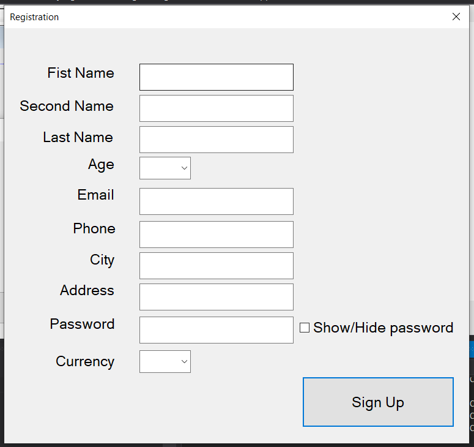
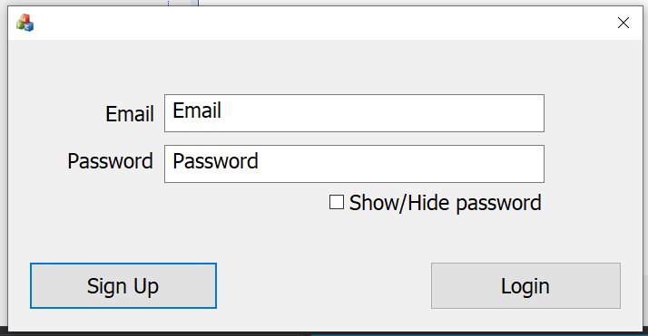
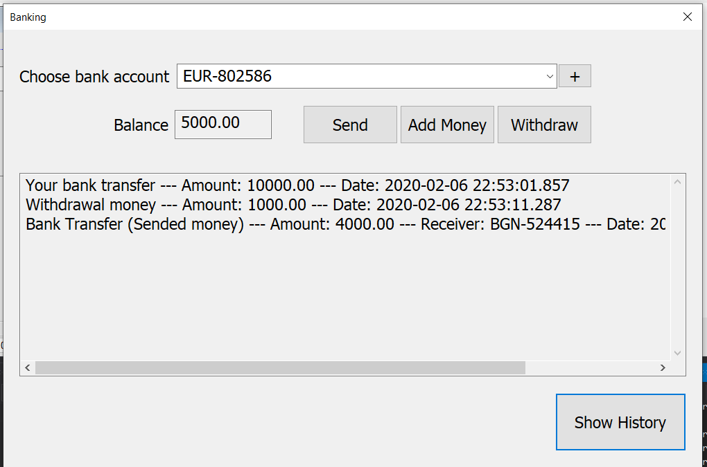

<h1 align = "center"> BankManagementSystem </h1>
<h2 align = "center"> C++ MFC </h2>

A simple bank management system, developed in C++, using Microsoft SQL Server 2017 Express and MFC (Visual C++).

<b> Connecting to SQL Server: </b>

  - Go to --> Database.cpp file
  - Change the Driver name --> on line 9 (or install ODBC Driver 17 for SQL Server)
  - Change the value of path variable to the Database file Directory--> on line 10
  - Change the value of serverName variable to the name of your SQL Server. --> on line 11
  - Change the value of nameDB variable to the name of your DataBase. --> on line 12
  - Change the value of user variable to username, that have access to the DataBase . --> on line 13
  - Change the value of user variable to password for the user . --> on line 14

<b> Functionalities of the program: </b>

  - Create Bank Account in different currencies
  - Add money
  - Withdraw money
  - Send money to another bank account
  - See the history of the transactions
  - Currency exchange
  
<b> Photos: </b>

